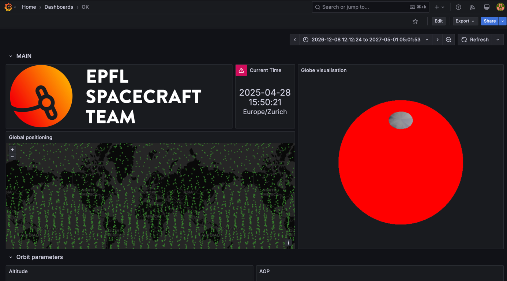
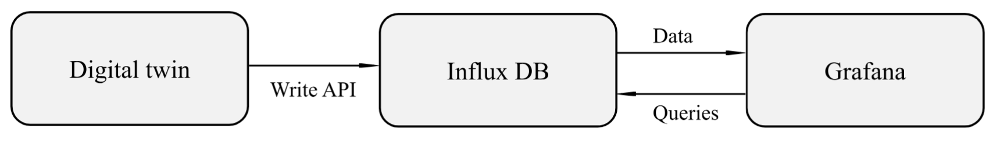
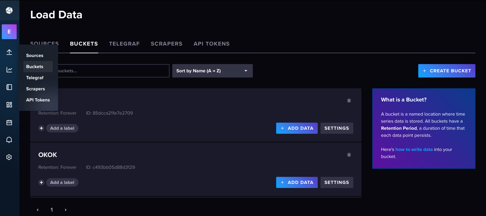
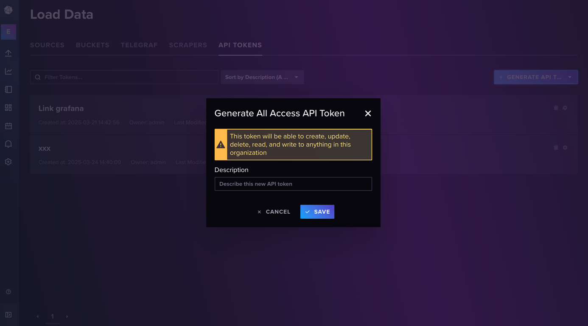
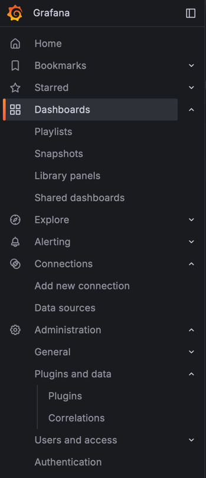
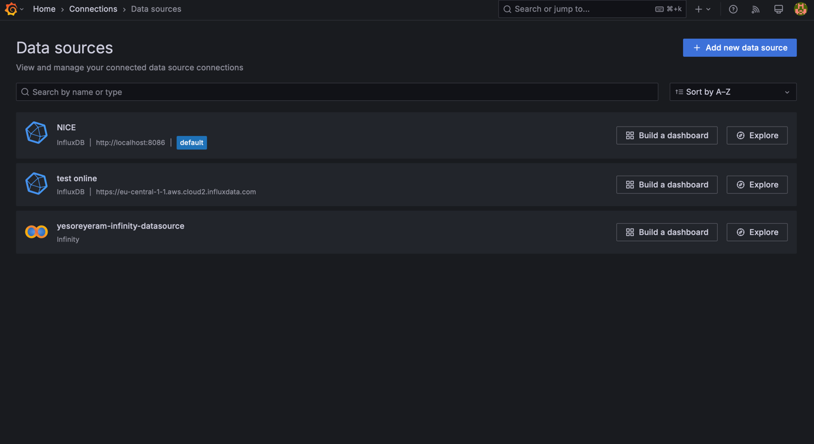
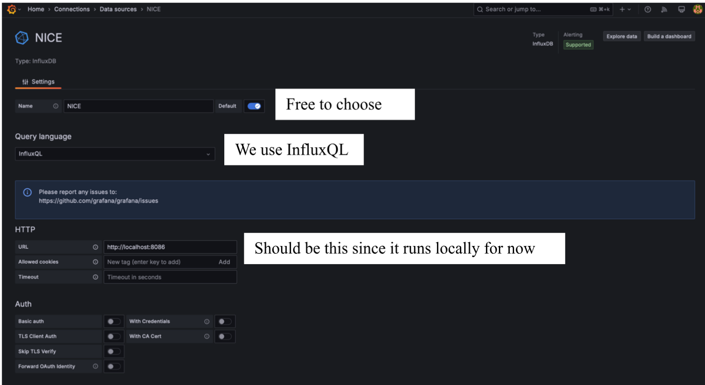
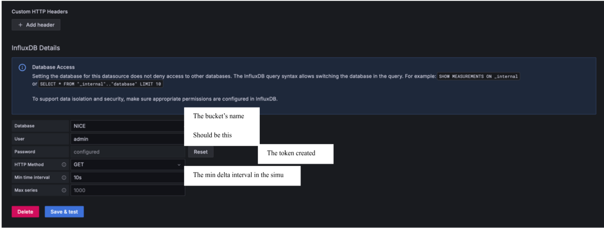
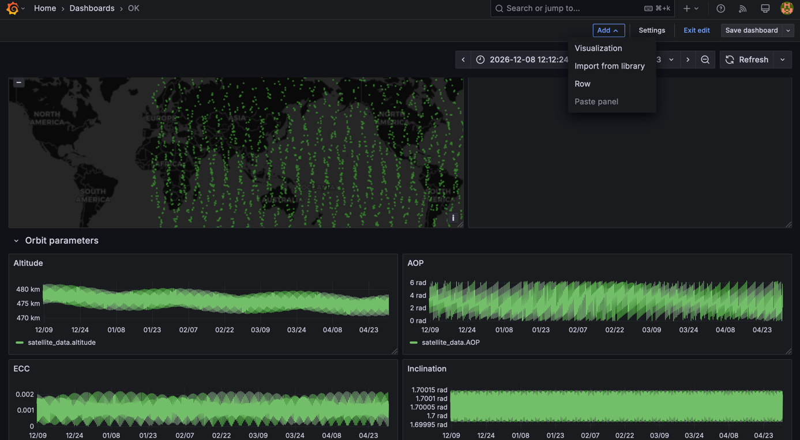
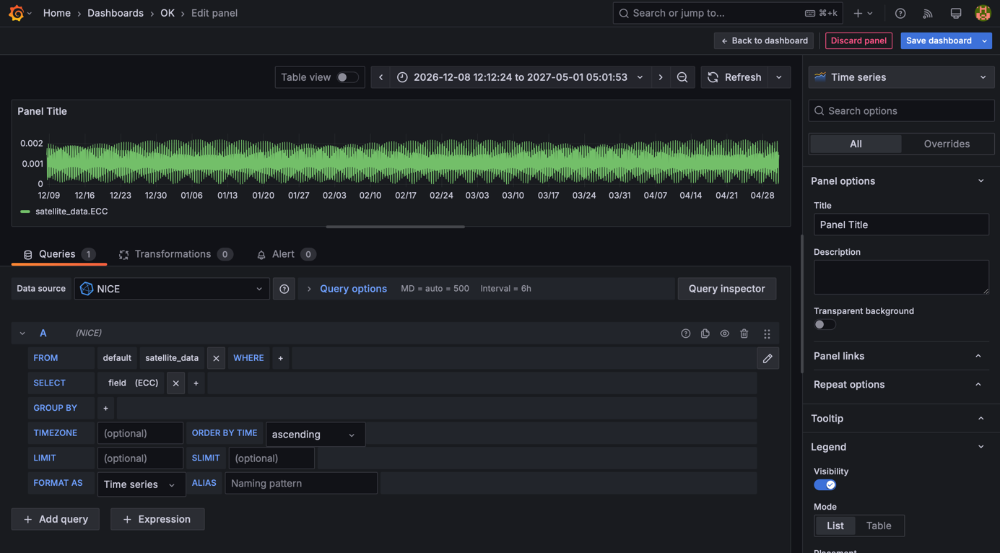

Grafana Visualization Documentation
===================================

Overview
--------

Grafana is a software used for data visualization. It queries data from multiple databases and displays it a very versatile tool, many programming languages are allowed and we can create and personalize as many visualizations as we want. Thanks to its dynamic visualization, it allows to better visualize, zoom, and slide in the data, compared to fixed plots.

For now, it's used to visualize the data coming from the digital twin but its ultimate goal is to visualize in real time all the data coming from the satellite to assess and monitor its health and operations.

   
   Final Grafana dashboard showing various CubeSat metrics

System Architecture
-------------------

To have a functional interface we need 3 components:

* A satellite (or simulation) that sends the data
* A database to store and return the data  
* A dashboard to write the queries and visualize the data

As the satellite is supposed to join the satnogs network, we chose to use the same infrastructure, meaning using InfluxDB as the database.

   
   Overview of the Grafana visualization system architecture

InfluxDB Setup
--------------

Database Configuration
~~~~~~~~~~~~~~~~~~~~~~

To store the data sent by the simulation, we need a "bucket" that can be created here. When creating, we can select the time of retention.

   
   InfluxDB bucket selection interface

API Token Generation
~~~~~~~~~~~~~~~~~~~~

We also need a token for authentication and API access, both in the python and Grafana interfaces. It can be created in the menu "API TOKENS" and must be copied for next steps.

   
   Generating an API token in InfluxDB

You can save it in a ``.env`` file you create in the root directory of the project, that looks like this:

.. code-block:: text

   INFLUXDB_TOKEN=<your_token_here>
   INFLUXDB_ORG=EST
   INFLUXDB_URL=http://localhost:8086
   INFLUXDB_BUCKET=NICE

This way it can automatically be loaded when running the python script.

Grafana Setup
-------------

Interface Overview
~~~~~~~~~~~~~~~~~~

This is what the side menu looks like.

   
   Grafana sidebar menu

The submenus that we use most are:

* **Dashboards**: to see the dashboards that we build
* **Connections**: to set up connections between Grafana and the different databases

Data Source Configuration
~~~~~~~~~~~~~~~~~~~~~~~~~

To set up a communication with the database, we need to add a source in "Add new connection", then click on "Add new data source"

   
   Adding a new data source in Grafana

We then need to choose InfluxDB and configure the connection with the following panels:

   
   InfluxDB data source configuration - Part 1

   
   InfluxDB data source configuration - Part 2

Once everything is set up, click on "Save & test", if it works it should display "datasource is working. 1 measurements found"

Dashboard Creation
~~~~~~~~~~~~~~~~~~

Then you can go back on the dashboard and start editing it. To add a panel, click on "Add > Visualization", the rows are here to organize the global layout.

   
   Adding a new panel to the dashboard

You can then edit the query either by clicking on the different measurements and fields or directly writing it in InfluxQL with the pen icon. You directly see the data chosen on the upper graph and you can customize its appearance in the right panel.

   
   Editing a panel with query configuration and visualization options

Installation & Setup
--------------------

Prerequisites
~~~~~~~~~~~~~

Install the required software:

* **InfluxDB**: https://docs.influxdata.com/influxdb/v2/install/
* **Grafana**: https://grafana.com/grafana/download

There are two ways to use Grafana: online and local, same for InfluxDB. For now everything works locally.

Default Credentials
~~~~~~~~~~~~~~~~~~~

Credentials for Grafana and InfluxDB:

* **Username**: admin
* **Password**: maxiadri

Starting the Services
~~~~~~~~~~~~~~~~~~~~~

**Launch InfluxDB**

Open a terminal and run:

.. code-block:: bash

   influxd

Access: http://localhost:8086/

**Launch Grafana**

Go to the installation folder, open a terminal and run:

.. code-block:: bash

   ./bin/grafana server

Access: http://localhost:3000/

Dashboard Import/Export
~~~~~~~~~~~~~~~~~~~~~~~

You can import the dashboard ``digital_twin_dashboard_grafana.json`` directly in the Dashboards menu in Grafana. You can then export the dashboard (save it as json) and update the version in the repository if you make any changes.

Data Upload Process
~~~~~~~~~~~~~~~~~~~

The data can be uploaded live during the simulation by settig the parameters ``influxdb_delta_t`` and ``influxdb_delta_t_unit`` in the simulation configuration json file. 
The data will then be sent to InfluxDB every specified simulated time interval and at the end of the simulation.
The upload can be deactivated by not setting ``influxdb_delta_t`` or settig it to -1. 
If the timeinterval is greater than the simulation time, the data will only be sent at the end of the simulation.

For Debugging or manual upload, you can also use the ``INFLUX_DB_LOCAL.ipynb`` notebook after running the simulation to upload the data saved to the csv file.

References
----------

* **InfluxDB Python Client**: https://docs.influxdata.com/influxdb/cloud/api-guide/client-libraries/python/
* **SatNOGS Dashboard Example**: https://dashboard.satnogs.org/d/1b1zIkuIz/catsat?orgId=1&refresh=30s&from=now-2d&to=now&timezone=utc&var-filter=&var-frame_type=$__all
* **Export & Import Dashboards**: https://doc.sitecore.com/xp/en/developers/101/managed-cloud/import-and-export-your-grafana-dashboards.html#export-your-grafana-dashboard